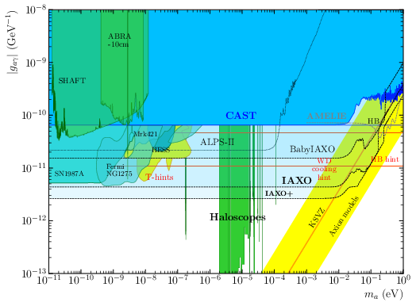

# iaxo-axion-limits
IAXO Axion Limits

To regenerate plots use:

```
python3 generatePlots.py
```



TODO: Create a proper documentation here. Adding image gallery examples.

TODO: Add few parameters to avoid commenting/discommenting code, enable batch mode, plot saving, etc.

TODO: It is possible to select the image output format?
