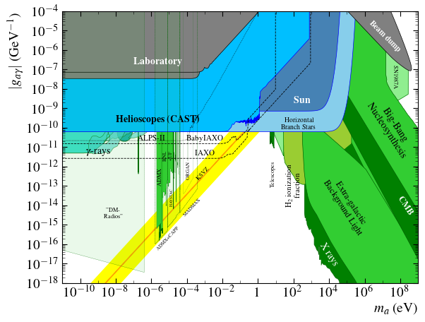
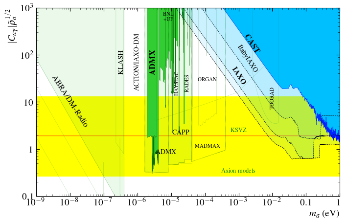
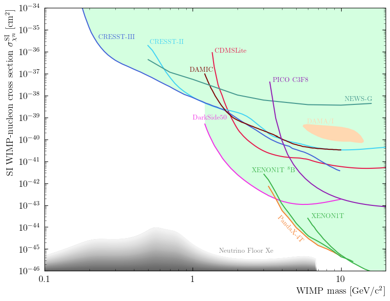

# IAXO axion-limits
Python package to generate the limit exclusion plots of different experiments of dark matter searches. For now, it includes axion (coupling to photon and electrons) and WIMPs (spin independent interaction only) experiments, although its called 'axion-limits'.

Some examples of these generated [plots](plots) can be found in the plots folder:

[](plots/large_panorama.png)
[](plots/haloscopes)

[](plots/wimps_lowmass.png)
# Installation
This package is currently not available at PyPi, so the installation requieres to download the source code from this repository. To do so, follow this steps:

Download this github repository

```bash
git clone https://github.com/iaxo/axion-limits.git
```
Change directory to this repository folder
```bash
cd axionlimits
```
Install the axionlimits package
```bash
pip install .
```
> [!NOTE]
> These steps will not install the necessary _LaTeX_ distribution to plot with _LaTeX_ font. If _LaTeX_ is not installed in the system (this is checked on run time), the default matplotlib font will be used.

>[!TIP]
> To install _LaTeX_ in Linux:
> ```bash
> sudo apt install texlive-full
> ```
> and get some coffee :coffee:, as this may take some time...


# Getting Started
The files [example_axionplot.py](example_axionplot.py) and [example_wimpplot.py](example_wimpplot.py) are given as simple examples on how to generate the sensitivity plots with this package. You can do this by executing any of this scripts. Let's take the axion case.

```bash
python3 example_axionplot.py
```

Inside this script you can find how to generate an exclusion plot with this package. The different exclusion lines are organize in SQL databases. For now, we have one database for [axion](data/Axions.db) experiments (which contains one table named AxionsGag for photon coupling and another one called AxionGae for electron coupling) and for [WIMPs](data/Wimps.db) experiments (which contains one table named WIMPs_SI for spin independent interaction). In order to load the desired database you may use the correspondent DataBase class defined in [databases.py](src/axionlimits/databases.py). In this case,

```python
import axionlimits.databases as db
from axionlimits.axion_plot import AxionGagPlot

# Load the default axion-photon coupling exclusion lines database of the package
database = db.DataBaseGag()
```
Then, write a list with the experiments name (matching the name column of the database) you want to include in the plot. 
```python
experimentsToPlot = [
    "qcdband",
    "ksvz",
    "CAST",
]
```
> [!NOTE]
> Note that the order in which the experiments are added to this list will be the order in which they are plotted, so the last experiments added will be drawn on top of the first ones.

Now, extract this rows (the _get_rows(field, values)_ method return the rows in the same order in which they are given in the values argument) from the database as follows:
```python
exps = database.get_rows("name", experimentsToPlot)
```
> [!TIP]  
> The `exps` dictionary provides detailed row information from the database for each selected experiment. The keys in this dictionary correspond to the names of the experiments, and the values are nested dictionaries where column names serve as keys. You can modify these values to customize the plot beyond the default settings.  
> For example, to replicate the iconic [AxionLimits](https://cajohare.github.io/AxionLimits/) style for the QCD band:  
> ```python
> exps["qcdband"]["drawOptions"] = "cmap=('YlOrBr', 0, 0.45, 40)"
> exps["ksvz"]["drawOptions"] += ", color='#a35c2f'"
> ```  


You may now include some labels. In order to do that, you can build a list where each element will be a label to plot. Each of these elements (labels) should be a tuple (or list) containing at least a string with the text of the label (_LaTeX_ formatting is available), the x position and y position. Optionally, a 4th element can be given containing a dictionary with the [matplotlib.pyplot.text()](https://matplotlib.org/stable/api/_as_gen/matplotlib.pyplot.text.html) keyword arguments to customize the text label as you want. For example,
```python
labels = [
    (r"{\bf Helioscopes (CAST)}", 1e-8, 2e-10, dict(color="black", size=10, picker=True)),
    ("KSVZ", 3e-4, 21e-14, dict( color="black", size=6, rotation=47)),
]
```
> [!TIP]
> The text labels with the parameter `picker` set to true (see "Helioscopes (CAST)" label in the example above) can be modified interactively in the shown figure. There are three options:
> * Move to a different position by clicking on the label and dragging it. The label will change the position when the click is released.
> * Increase or decrease the font size by scrolling the mouse roulette while holding the click on the text label or while keeping pressed the `ctrl` key.
> * Rotate the label by pressing the keys `+` (anticlockwise) or `-` (clockwise) while holding the click on the text label.
>
> After picking a text label, the anchor point of the text will be drawn as a red dot. This serves as a reference of the text position. Note that the anchor point varies depending on the [text alignment](https://matplotlib.org/stable/gallery/text_labels_and_annotations/text_alignment.html).
> 
> If you want to rotate or resize the text but don't want to move its position, hold the click on the anchor point. When saving the image don't worry about it, as the anchor point will be automatically deleted. Anyways, you can manually remove it using the right click.
> 
> Note that these changes on the text labels will be printed in the final graph image but it will not be recorded in the script, so the graph will not be reproducible. For that purpose, the values of the label position, fontsize and rotation (and rotation mode) will be printed in the output terminal so you can copy these values and change them manually on the script to keep record of the label positions.

Finally, call the AxionPlot constructor to generate the plot.
```python
axionplot = AxionGagPlot(
    experiments=exps,
    labels=labels,
    plotCag=False,  # set to true to plot C_ag instead of g_ag
    showplot=True,  # set to false to add the labels later
    saveplotname="test.pdf",
)
```
Use the parameter `experiments` and `labels` to pass the previously defined data and labels. If a string is given to the `saveplotname`, it will save the plot in a file with that name (default extension will be pdf if none is given within the filename). You can check other useful customization arguments at [axion_plot.py](src/axionlimits/axion_plot.py).
> [!TIP]
> You can add any additional matplotlib.pyplot object (such as lines or text) or further customize the figure. Just set the parameter `showplot=False` above and insert the desired plotting objects and customizations. Afterwards, remember to call the `show_plot` and `save_plot` methods. Check out this [example](myPlottingScripts/haloscope_zoom_Jun2024.py) for reference.

Inside [myPlottingScripts](myPlottingScripts) folder you can find real examples of scripts used to generate the figures inside [plots](plots) folder.

# Project contents
### Source files
The main files where the code is written are in the [src](src/axionlimits) folder. The code contains the following modules

1. x_plotter.py : the matplotlib.pyplot objects creation and configuration are
   handled within the two classes (BasePlot and ExPltItem) defined in this file
2. axion_plot.py : the creation of the BasePlot for the two cases (AxionGagPlot
   and AxionGaePlot), the plotting of the data and labels are handled within
   this classes.
3. wimp_plot.py : the creation of the BasePlot, the plotting of the data and labels are handled within this class.
4. databases.py : Here the DataBase classes are defined to interface with
   the SQLite .db files. It has the following classes:
   - DataBase is the generic database class that can be used to load an already existing database.
   - DataBaseGag to create the database table of AxionGag experiments.
   - DataBaseGae to create the  database table of AxionGae experiments.
   - DataBaseWimps to create the database table of WIMps experiments.

All these files are not intended to be modified by the user.

## Subdirectories description

1. labeler : all needed files (html and java) for the labels app.
2. data : here the .txt or .dat files with the exclusion lines of the different
   experiments should be stored.
3. databases : here the .db files with the databases of the experiments data and
   labels should be stored. Include here any new database you build to make a
   new plot you may want to reproduce in the future.
4. plots : here the saved plots should be stored. The relative path to this
   directory is added automatically to the plotname specified by the user.
5. myPlottingScripts : this folder is meant to serve as the warehouse of the
   scripts used to generate a plot you may want to reproduce in the future. Here
   you can found some examples as large_panorama.py, panorama.py,
   helioscopes.py, haloscopes.py and lsw.py .

# Handling the databases
The different dark matter detection experiment are organize in SQL databases. For now, we have one database for [axion](data/Axions.db) experiments (which contains one table named AxionsGag for photon coupling and another one called AxionGae for electron coupling) and for [WIMPs](data/Wimps.db) experiments (which contains one table named WIMPs_SI for spin independent interaction). Any of this table databases contain at least these first columns:
1. **_name_** : string used to identify the experiment. It should be unique (although it is not forbidden) to the data that would load, so is recommended to add some other identificative tag to the experiment name itself. For example, instead of just _ADMX_ you may use _ADMX2021_ .
2. **_type_** : string used to specify the type of exclusion data it is. It can hold this valid values:
   - _line_ : it will be plotted as a line. In WimpPlot, it will be included by default to get the exclusion region.
   - _region_ : it will be plotted as an enclosed surface on the plot.
   - _band_ : it will be plotted as an open surfarce from the line defined in the data up to the top of the figure.
   - _fog_ : it will be plotted as an open surfarce from the line defined in the data down to the bottom of the figure. For example, it is used for neutrino fog (or floor) representation on WimpPlot.

   Each of this will use a different matplotlib.pyplot method (see [XPlotter](src/axionlimits/x_plotter.py)).
3. **_path_** : string containing the relative path (from the database file directory) to the data file (.txt or .dat) where the data of that experiment is contained. This file should be inside the data/axion/ or data/wimp/ directory. For example: _axion/ADMX2018.txt_
4. **_drawOptions_** : string containing the customization options for the plotting method of matplotlib.pyplot used (dependent on the _type_). For example: _facecolor='limegreen', edgecolor='darkgreen', lw=0.2_
5. **_projection_** : integer (_0_ or _1_) that indicates if the data is just a prospect/projection for future results (_1_) or if it is a reported result (_0_).
6. **_source_** : string containing the origin of the data. It can be the DOI of the publication, the arXiV identifier or any other way of tracing the origin of the data. This information should also be included inside the data file as a header (starting with the comment character # ). For example: _2110.06096_
7. **_year_** : string containing the year of release of the data. For example: _2019_


Furthermore, the different DM candidates databases have more specific additional columns. In order to create the desired database you may use the correspondent database class defined in [databases.py](src/axionlimits/databases.py).

## Loading a database

The package includes default databases installed with the source code. To load one, use any of the `DataBase` subclasses:

- `DataBaseGag`: Axion-photon coupling exclusion limits.
- `DataBaseGae`: Axion-electron coupling exclusion limits.
- `DataBaseWimps`: WIMP-nucleon spin-independent cross-section exclusion limits.

Each subclass is preconfigured to load its corresponding default database.

```python
import axionlimits.databases as db

# Load the default axion-photon coupling database
database_gag = db.DataBaseGag()

# Load the default axion-electron coupling database
database_gae = db.DataBaseGae()

# Load the default wimp-nucleon SI cross section database
database_wimps = db.DataBaseWimps()
```

> [!NOTE]
> Ensure no file with the same name as the default database exists in your current directory. Local files take precedence over package-installed files during the search (see get_absolute_path in [utils.py](src/axionlimits/utils.py)).

## Adding new data to the database
Once loaded, you can edit the database if you want. By default, the database
file will not be edited. To commit the changes to the db file, set parameter
`commit=True` at the constructor or use the DataBase.set_commit(True) method. For
example, you can add a new row with the following command:

```python
database.set_commit(True) # to commit the changes to the .db file
database.insert_row("exp_name", "line", "path_to_datafile", "color='red', linewidth=2", 0, 'source?', 'year?', 0, 0, 0, 0, 0, 0, 0, 0)
database.set_commit(False) # go back to default mode (not committing changes to the .db file)
```
> [!IMPORTANT]
> If you do so, please consider adding this new row of the database in the python script [build_database.py](src/axionlimits/data/build_databases.py) as this file serves as backup for generating the databases in case they are unintentionally changed or deleted.

## Editing existing row of the database
You may want to change temporary the column value of an existing row. In that case you can load the database with the default parameter commit=False. Then, you can change the drawOptions of a row as follows:

```python
database.update_row("exp_name", "drawOptions", "color='blue', linewidth=1")
```

Or delete a row:

```python
database.delete_rows("name='exp_name'") # set parameter confirm=True to avoid the security check
```
> [!CAUTION]
> To commit this changes to the database file is not recommended as it could make previous plots not reproducible in the future even with their original plotting script.

## Creating a new database

To create a new database for a new plot you may follow this examples. Note the parameter `commit=True` at the constructor of the databases to commit the changes to the db
file.

For a axion-photon (Gag) database:
```python
import axionlimits.databases as db
database = db.DataBaseGag("NewAxions.db", commit=True) # this will create (if it doesn't already exists) a table named AxionsGag (default) at NewAxions.db
path = "data/axion/"
AxionsGag = [
    ['qcdband', 'band', path + 'QCD_band.dat', "facecolor='yellow'", 0, '', '', 1, 1, 0, 0, 0, 0, 0, 0],
    ['CMB_DEsuE', 'band', path + 'cosmoalp/CMB_DEsuE.txt', "facecolor='forestgreen', edgecolor='darkgreen', linewidth=0.5", 0, '1110.2895', '2011', 0, 0, 1, 0, 0, 0, 0, 0],
    ['old_haloscopes', 'band', path + 'MicrowaveCavities.txt', "facecolor='limegreen', edgecolor='darkgreen', linewidth=0.2", 0, '', '', 0, 0, 1, 1, 0, 0, 0, 0],
    ['RADES2021', 'band', path + 'RADES2021.txt', "facecolor='limegreen', edgecolor='darkgreen', linewidth=0.2", 0, '2104.13798', '2021', 0, 0, 1, 1, 0, 0, 0, 0],
    ['CAST', 'band', path + 'cast_env_2016.dat', "facecolor='deepskyblue', edgecolor='blue', linewidth=0.5", 0, '', '', 0, 0, 0, 0, 1, 1, 0, 0],
    ['BabyIAXO', 'band', path + 'miniIAXO.dat', "facecolor='deepskyblue', linewidth=0.5, alpha=0.1, linestyle='-'", 1, '', '', 0, 0, 0, 0, 1, 1, 0, 0],
    ['IAXO', 'band', path + 'IAXO_nominal.txt', "facecolor='deepskyblue', linewidth=0.5, alpha=0.1, linestyle='-'", 1, '', '', 0, 0, 0, 0, 1, 1, 0, 0],
]
database.insert_rows(AxionsGag)
data = database.read_rows()
print(data)
```

For a Gae exclusion plot:

```python
import axionlimits.databases as db
database = db.DataBaseGae("NewAxions.db", commit=True)  # this will create (if it doesn't already exists) a table named AxionsGae (default) at NewAxions.db
path1 = 'data/axion/hints/'
path2 = 'data/axion/gaegag/'

AxionsGae= [
    ["DFSZ1_starhint", "region", path1 + "DFSZ1_ABC_dominant_No_SN_2sigma_hint_rootgaegag_vs_ma.dat", "facecolor='springgreen', edgecolor='darkgreen', alpha=0.2", 0, '', ''],
    ["AJ83_starhint", "region", path1 + "AJ83_ABC_dominant_No_SN_2sigma_hint_rootgaegag_vs_ma.dat", "facecolor='red', edgecolor='red', alpha=0.2", 0, '', ''],
    ["QCDband", "band", path2 + "DFSZband_gaegag.dat", "facecolor='lemonchiffon', edgecolor='none', linewidth=1", 0, '', ''],
    ["CAST_gae", "band", path2 + "CAST_gae_gagg.dat", "facecolor='steelblue', edgecolor='darkblue', linewidth=0.5", 0, '', ''],

    ["IAXO_gae", "band", path2 + "sqrtgaagae_sc2.dat", "facecolor='skyblue', edgecolor='black', linewidth=0.5, alpha=0.3", 1, '', ''],
    ["IAXO_gae_l", "line", path2 + "sqrtgaagae_sc2.dat", "color='black', linewidth=0.5, linestyle='--'", 1, '', ''],
]
database.insert_rows(AxionsGae)
data = database.read_rows()
print(data)
```

# Labels web app

To quickly add new labels to the plots in a easy way (although this would not be
saved anywhere to be reproduced) you may use the labels app programmed in the
labeler directory. Or just click on the following link:
[Label's APP](https://danielmartinezmiravete.github.io/Labels-App/)

You can start the app by opening the HTML script called 'index.html'. This
application is only capable of modifying SVG files. Instructions for the webpage
are provided within the webpage itself.

## Known Issues

- The labels application cannot interpret _LaTeX_.
- At labels application, when working with multiple labels, moving a label other
  than the last label will replace the coordinates of the last label written.

# Acknowledgements
External contributors:

- Daniel Martínez Miravete contribution for an internship within the IAXO group of University of Zaragoza on summer 2023
(https://github.com/DanielMartinezMiravete/Axion_Limits_Memory) for his Bachelor in Physics. Internship supervised by [Juan Antonio García](https://github.com/juanangp) and [Álvaro Ezquerro](https://github.com/AlvaroEzq). Also, very helpful insight
was given by [David Díez](https://github.com/DavidDiezIb) and [Luis Antonio Obis](https://github.com/lobis).
