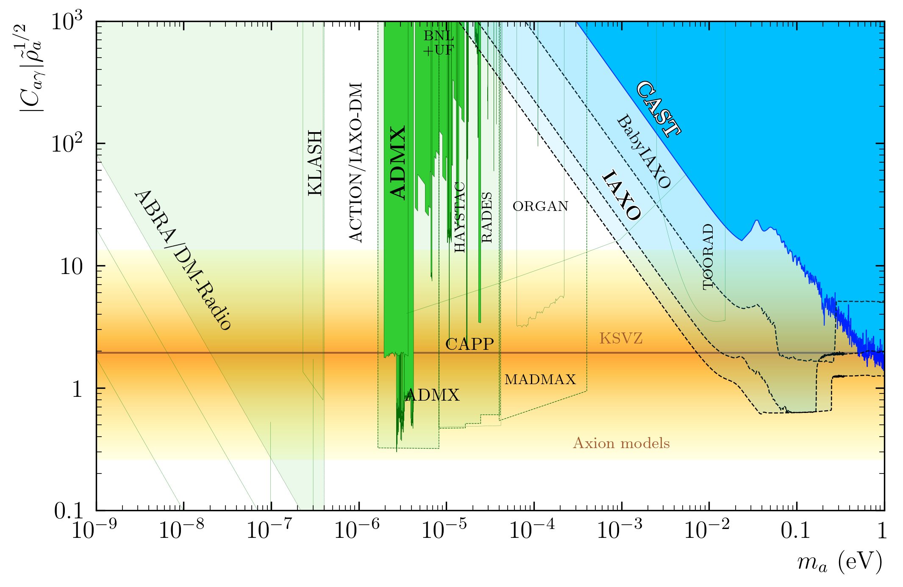

# [IAXO axionlimits](https://github.com/iaxo/axion-limits) 🌌🐍
A Python package for generating limit exclusion plots from various dark matter particle candidates. Currently, it supports axion experiments (photon and electron coupling) and WIMP experiments (spin-independent interactions). Despite its name, 'axionlimits' covers both types of experiments.  

You can find some examples of the generated [plots](plots) in the plots folder:  

[](plots/large_panorama.png)
[](plots/haloscopes_2024_stylish.png)

[](plots/wimps_lowmass.png)
# Installation ⚙️
This package is currently not available at PyPi, so the installation requieres to download the source code from this repository. To do so, follow these steps:

1️⃣ Download this github repository

```bash
git clone https://github.com/iaxo/axion-limits.git
```
2️⃣ Change directory to this repository folder
```bash
cd axionlimits
```
3️⃣ Install the axionlimits package
```bash
pip install .
```
> [!NOTE]
> These steps will not install the necessary _LaTeX_ distribution to plot with _LaTeX_ font. If _LaTeX_ is not installed in the system (this is checked on run time), the default matplotlib font will be used.

>[!TIP]
> To install _LaTeX_ in Linux:
> ```bash
> sudo apt install texlive-full
> ```
> and get some coffee :coffee:, as this may take some time...


# Getting Started 👨‍💻
The files [example_axionplot.py](example_axionplot.py) and [example_wimpplot.py](example_wimpplot.py) are given as simple examples on how to generate the sensitivity plots with this package. You can do this by executing any of this scripts. Let's take the axion case.

```bash
python3 example_axionplot.py
```

Inside this script you can find how to generate an exclusion plot with this package. The different exclusion lines are organize in SQL databases. For now, we have one database for [axion](data/Axions.db) experiments (which contains one table named AxionsGag for photon coupling and another one called AxionGae for electron coupling) and for [WIMPs](data/Wimps.db) experiments (which contains one table named WIMPs_SI for spin independent interaction). In order to load the desired database you may use the correspondent DataBase class defined in [databases.py](src/axionlimits/databases.py). In this case,

```python
import axionlimits.databases as db
from axionlimits.axion_plot import AxionGagPlot

# Load the default axion-photon coupling exclusion lines database of the package
database = db.DataBaseGag()
```
Then, write a list with the experiments name (matching the name column of the database) you want to include in the plot. 
```python
experimentsToPlot = [
    "qcdband",
    "ksvz",
    "CAST2021",
]
```
> [!NOTE]
> Note that the order in which the experiments are added to this list will be the order in which they are plotted, so the last experiments added will be drawn on top of the first ones.

Now, extract these rows (the _get_rows(field, values)_ method return the rows in the same order in which they are given in the values argument) from the database as follows:
```python
exps = database.get_rows("name", experimentsToPlot)
```
> [!TIP]  
> <details>
> <summary><h3> Can I edit the default plotting style of these items? </h3></summary>
> 
> Yes! The `exps` dictionary provides detailed row information from the database for each selected experiment. The keys in this dictionary correspond to the names of the experiments, and the values are nested dictionaries where column names serve as keys. You can modify these values to customize the plot beyond the default settings.
> For example, to replicate the iconic [AxionLimits](https://cajohare.github.io/AxionLimits/) style for the QCD band:
>
> ```python
> exps["qcdband"]["drawOptions"] = "cmap=('YlOrBr', 0, 0.45, 40)"
> exps["ksvz"]["drawOptions"] += ", color='#a35c2f'"
> ```
> </details>


You may now include some labels. In order to do that, you can build a list where each element will be a label to plot. Each of these elements (labels) should be a tuple (or list) containing at least a string with the text of the label (_LaTeX_ formatting is available), the x position and y position. Optionally, a 4th element can be given containing a dictionary with the [matplotlib.pyplot.text()](https://matplotlib.org/stable/api/_as_gen/matplotlib.pyplot.text.html) keyword arguments to customize the text label as you want. For example,
```python
labels = [
    (r"{\bf Helioscopes (CAST)}", 1e-8, 2e-10, dict(color="black", size=10, picker=True)),
    ("KSVZ", 3e-4, 21e-14, dict( color="black", size=6, rotation=47)),
]
```
> [!TIP]
> <details>
> <summary><h3> Can I drag and move interactively the labels? </h3></summary>
> 
> Yes! The text labels with the parameter `picker` set to true (see "Helioscopes (CAST)" label in the example above) can be modified interactively in the shown figure. There are three options:
>
> * Move to a different position by clicking on the label and dragging it. The label will change the position when the click is released.
> * Increase or decrease the font size by scrolling the mouse roulette while holding the click on the text label or while keeping pressed the `ctrl` key.
> * Rotate the label by pressing the keys `+` (anticlockwise) or `-` (clockwise) while holding the click on the text label.
>
> After picking a text label, the anchor point of the text will be drawn as a red dot. This serves as a reference of the text position. Note that the anchor point varies depending on the [text alignment](https://matplotlib.org/stable/gallery/text_labels_and_annotations/text_alignment.html).
> 
> If you want to rotate or resize the text but don't want to move its position, hold the click on the anchor point. When saving the image don't worry about it, as the anchor point will be automatically deleted. Anyways, you can manually remove it using the right click.
> 
> Note that these changes on the text labels will be printed in the final graph image but it will not be recorded in the script, so the graph will not be reproducible. For that purpose, the values of the label position, fontsize and rotation (and rotation mode) will be printed in the output terminal so you can copy these values and change them manually on the script to keep record of the label positions.
> </details>


Finally, call the AxionPlot constructor to generate the plot.
```python
axionplot = AxionGagPlot(
    experiments=exps,
    labels=labels,
    plotCag=False,  # set to true to plot C_ag instead of g_ag
    showplot=True,  # set to false to add the labels later
    saveplotname="test.pdf",
)
```
Use the parameter `experiments` and `labels` to pass the previously defined data and labels. If a string is given to the `saveplotname`, it will save the plot in a file with that name (default extension will be pdf if none is given within the filename). You can check other useful customization arguments at [axion_plot.py](src/axionlimits/axion_plot.py).
> [!TIP]
> <details>
> <summary><h3> Can I draw additional matplotlib items into the plot? </h3></summary>
>
> Yes, you can add any additional matplotlib.pyplot object (such as lines or text) or further customize the figure. Just set the parameter `showplot=False` above and insert the desired plotting objects and customizations. Afterwards, remember to call the `show_plot` and `save_plot` methods. Check out this [example](myPlottingScripts/haloscope_zoom_Jun2024.py) for reference.
> </details>

📂 Inside [myPlottingScripts](myPlottingScripts) folder you can find more complex examples of scripts used to generate the figures at [plots](plots) directory.

## Add curves that are not in the database

Sometimes you may want to plot curves that are not stored in the database, for example a future sensitivity projection, a preliminary result, or a custom line for quick comparisons. In these cases, add a new entry to the `exps` dictionary with the minimum required fields. For example:

```python
exps["myNewLine"] = {
    "type": "line", # required: one of "line", "band", "region", or "fog"
    "path": "/path/to/the/data/file.dat", # required
    "drawOptions": "color='red', linewidth=0.5, linestyle='-'", # optional but recommended
}
```

Keep in mind that the plotting order follows the insertion order of `exps`. If you need your custom curve in a specific position, split the experiment lists and build `exps` in steps. For example:

```python
# split the original experimentsToPlot list to insert 'myNewLine' in the middle
qcdToPlot = [
    "qcdband",
    "ksvz",
]
experimentsToPlot = [
    "CAST2021",
]

# add items in the desired plotting order
exps = {}
exps.update(database.get_rows("name", qcdToPlot))
exps["myNewLine"] = {
    "type": "line",
    "path": "/path/to/the/data/file.dat",
    "drawOptions": "color='red', linewidth=0.5, linestyle='-'",
}
exps.update(database.get_rows("name", experimentsToPlot))
```

## Enhanced Options

### Gradient Filling with Colormap  

This feature enables gradient color filling for bands, regions, and fog areas using customizable colormaps.  

##### Usage:
Add the `cmap` argument in `drawOptions` to define the gradient. This will generate the color sequence (`cseq`). It accepts a tuple with the following elements:
  1. **Colormap name or base color** (e.g., `'Greys'`, `'darkcyan'`, `(0, 0, 0)`, or `'#ff0000'`). Check the full list of [colormaps](https://matplotlib.org/stable/users/explain/colors/colormaps.html).
  2. **Minimum colormap value or alpha** (default range: 0–1).
  3. **Maximum colormap value or alpha** (default range: 0–1; values >1 delay the gradient start).
  4. **Number of gradient steps** (higher values create smoother gradients but may impact performance). 
  
  Example: `cmap=('Greys', 0.1, 1, 50)`.

> [!TIP]
> Reverse gradient direction by swapping the second and third `cmap` values. E.g. `cmap=('Greys', 1, 0.1, 50)`. 

Or add the `cseq` argument for fully custom gradients, use, e.g., `cseq=['red', 'blue', 'green']`.  

### Adding Borders to Text

This feature allows you to add a customizable border (or outline) around text using the new `bordercolor` (`bc`) and `borderwidth` (`bw`) keyword arguments when plotting labels through `BasePlot.plot_labels` method.

#### Usage
To add a border around text, simply provide the following arguments to the label element passed to the `BasePlot.plot_labels` method.
- **`bordercolor` (`bc`)**: The color of the text border. Defaults to `'black'` if not provided but `borderwidth` is specified.
- **`borderwidth` (`bw`)**: The thickness of the text border. Defaults to `1` if not provided but `bordercolor` is specified.

If neither `bordercolor` nor `borderwidth` is specified, no border will be applied.

# Databases 📗
The different dark matter detection experiment are organize in SQL databases. For now, we have one default database for [axion](data/Axions.db) experiments (which contains one table named AxionsGag for photon coupling and another one called AxionGae for electron coupling) and another one for [WIMPs](data/Wimps.db) experiments (which contains one table named WIMPs_SI for spin independent interaction).

Each table includes essential columns such as:  
- **_name_**: A unique identifier for the experiment.  
- **_type_**: Specifies the exclusion data type (_line_, _region_, _band_, _fog_).  
- **_path_**: Relative path to the data file.  
- **_drawOptions_**: Customization options for matplotlib plotting.  
- **_projection_**: Indicates whether the data is a projection (_1_) or a reported result (_0_).  
- **_source_**: Origin of the data (e.g., DOI or arXiv ID).  
- **_year_**: Year of the data release.  


Additional columns specific to each dark matter candidate are also included.

## Loading a database

The package includes default databases installed with the source code. To load one, use any of the `DataBase` subclasses:

- `DataBaseGag`: Axion-photon coupling exclusion limits.
- `DataBaseGae`: Axion-electron coupling exclusion limits.
- `DataBaseWimps`: WIMP-nucleon spin-independent cross-section exclusion limits.

Each subclass is preconfigured to load its corresponding default database.

```python
import axionlimits.databases as db

# Load the default axion-photon coupling database
database_gag = db.DataBaseGag() # loads file Axions.db, table AxionsGag

# Load the default axion-electron coupling database
database_gae = db.DataBaseGae() # loads file Axions.db, table AxionGae

# Load the default wimp-nucleon SI cross section database
database_wimps = db.DataBaseWimps() # loads file Wimps.db, table Wimps_SI
```

> [!NOTE]
> Ensure no file with the same name as the default database exists in your current directory. Local files take precedence over package-installed files during the search (see get_absolute_path in [utils.py](src/axionlimits/utils.py)).

## Adding new data to the database

You can modify the database after loading it. By default, changes are not saved to the database file. To commit changes, enable the `commit` mode by setting `commit=True` when initializing the database or by calling the `DataBase.set_commit(True)` method.  

For example, to add a new row to the axion-photon (Gag) coupling database table:  

```python
database_gag.set_commit(True)  # Enable commit mode to save changes to the .db file
database_gag.insert_row("exp_name", "line", "path_to_datafile", "color='red', linewidth=2", 0, 'source?', 'year?', 0, 0, 0, 0, 0, 0, 0, 0)
database_gag.set_commit(False)  # Disable commit mode to return to default (no changes saved)
```
> [!IMPORTANT]
> When adding new rows, update the corresponding Python script ([build_database.py](src/axionlimits/data/build_databases.py)) to ensure the database can be rebuilt. This script serves as a reliable backup for generating the databases.


# Contributors💫
- IAXO collaboration contributors:
   - [Álvaro Ezquerro](https://github.com/AlvaroEzq)
   - [Igor G. Irastorza](https://github.com/igarciai)
   - [Luis Obis](https://github.com/lobis)

- External contributors:

   - Daniel Martínez Miravete contribution for an internship within the IAXO group of University of Zaragoza on summer 2023
(https://github.com/DanielMartinezMiravete/Axion_Limits_Memory) for his Bachelor in Physics. Internship supervised by [Juan Antonio García](https://github.com/juanangp) and [Álvaro Ezquerro](https://github.com/AlvaroEzq). Also, very helpful insight
was given by [David Díez](https://github.com/DavidDiezIb) and [Luis Antonio Obis](https://github.com/lobis).
